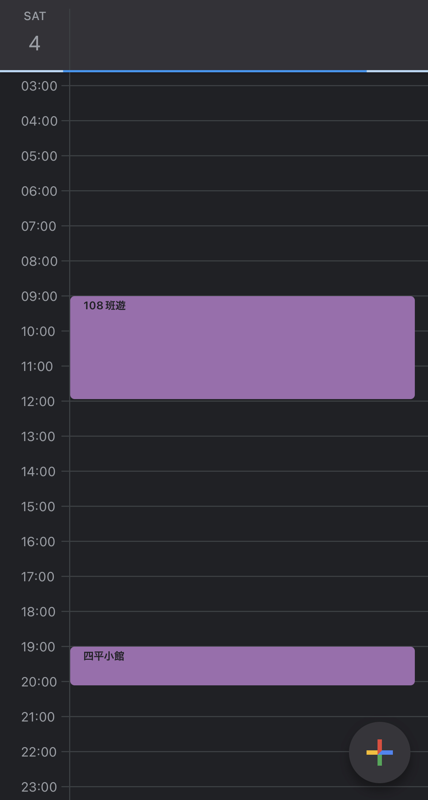

# CALBOT
This repository hosts a bot written in [Koa](https://koajs.com/) that makes a message block on [LINE messenger](https://line.me/en/) with appointments on Google Calendar by calling [Google Calendar API](https://developers.google.com/calendar/api/v3/reference).



The above screenshot is a given date on Google Calendar. As shown, there are 2 appointments made during the day.


The app will invoke Google API to get appointments of a given day from the calendar and map it to message form in LINE.
Furthermore, the "Ask" button can be used to reply to a certain event.

## Getting started
There are a few steps to take to get the app started:

### LINE Developer Console
Follow the docuentation [here](https://developers.line.biz/en/docs/messaging-api/building-bot/) to finish the setup.
As for the `webhook URL`, let's leave it for later once we setup a public `https` connection and come back to it.

Meanwhile, fill in the keys in `.env` file.

### Google API
Go to [Google Developers](https://developers.google.com/) and create a project there.
Navidate to `Google Calendar` and click on `credentials` tab. Here you can create an OAuth 2.0 Client ID for the project.

Select `Desktop` for Application Type and then you can download the credentials in json format.

Rename it to `credentials.json` and place it in project root folder.

### Clone the project
Clone the repo and install dependencies:
```bash
npm install
```

Launch the app:
```bash
docker compose up
```
Now the endpoint is revealed at `http://localhost:3000`.
However, in order to use the endpoint as a webhook on LINE, it is mandatory to have an `https` link.

### AWS Setup
Create a user and follow [best practice in IAM](https://docs.aws.amazon.com/IAM/latest/UserGuide/best-practices.html).
Assign `APIGateway` and `EC2` full access policies to the group where you assign your IAM user.

### Deployment
The docker image can be deployed to AWS [EC2](https://docs.aws.amazon.com/ec2/). 
Based on personal experiment, `t2.small` tier with 12GB of storage is enough to host the project.

Binding it with [API Gateway](https://aws.amazon.com/api-gateway/) will then get you an `https` link, which you can put in LINE developer console.


## To-dos
- [ ] See logging from CloudWatch
- [ ] Refactor service in serverless fashion, i.e. using Lambda

Any feedbacks are welcomed!

## References
1. [LINE Developers](https://developers.line.biz/en/docs/messaging-api/nodejs-sample/)
2. [Google Calendar API](https://developers.google.com/calendar/api/v3/reference)